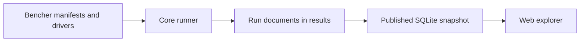

# Engine architecture

A benchmark run takes a selection from the catalog, prepares the drivers for the
libraries it names, and writes their measurements into a run document. The catalog
is where each library's API gets mapped onto the shared workload vocabulary; core
owns everything downstream of that mapping: resolving the selection, executing
the drivers, collecting their output and projecting it into the database the
website reads.

## Repositories and packages

Keeping each adapter beside its source pin in the catalog means the version being
measured and the code calling it are reviewed together. Upstream libraries need no
spatial-bench integration of their own, and run records follow a separate
review-and-publication path in the results repository.

Inside core, `spatial-bench-core` implements the catalog, execution and result
types, and `spatial-bench-cli` exposes them as commands. `spatial-bench-dataset`
produces the shared input points, `spatial-bench-measure` provides Criterion-based
measurement for Rust drivers, and `spatial-bench-charting` renders local charts.
Generated Rust programs depend on the measurement crate.

## Cases, selectors and points

A manifest describes one library: its source, the drivers that measure it, and the
workloads those drivers support. Matrix expansion turns the declared tag and matrix
values into cases with fixed tags, and each case carries its parameter domains,
defaults, adapter and supported runners.

For kdtree, `axis=f64` and `k=1` together identify a single case, while `tree_size`
and `query_count` are runtime parameters. Resolving those parameters produces the
workload tag map for a measured point. Selectors do double duty: they filter cases
and constrain parameter values, and any omitted parameter falls back to its
default.

Core validates shared tags against its vocabulary, while library-specific options
use namespaced keys such as `kiddo.stem`. The `defaults_or_tuned` classification is
derived by comparing a case's values against the manifest defaults, which means the
declared defaults need review from someone who knows how the library is normally
configured. Several measurements can share one tag map; it is the run document
around them that supplies the source and machine context needed to tell them apart.

## Driver preparation and execution

The `rust-codegen` adapter generates a program containing the selected compile-time
instantiations and builds it with Cargo, then reuses that binary across runtime
sweeps. The `exec` adapter prepares a C++ executable or a Python environment from
its build recipe. Despite the difference, both receive their resolved cases through
the same harness protocol.

Which axes are compile-time depends on the library. kdtree specializes on scalar
type, for instance, while another driver might also specialize dimensionality or
memory layout. Deterministic code generation and content-addressed build
directories let repeated selections reuse earlier work.

Before measuring, the run pipeline selects a shared Rust toolchain for the chosen
Rust drivers, checks the machine fingerprint, and warns when the estimated memory
use is large. That estimate is a lower bound and excludes index and build overhead.
`conform` follows the same preparation path, then compares the driver's `--list`
output against the compile-time registrations its manifest declares.

## Measurement and recorded results

The harness protocol sends one JSON `RunSpec` on stdin, containing the budget and
the resolved cases with their generator path, distribution and seed. Drivers reply
with `Point` records as JSON Lines on stdout and send diagnostics to stderr. The
protocol carries a version so that a driver can reject input it does not understand.

Drivers generate their inputs and prepare query state before timing begins. Rust
query drivers use the measurement crate's Criterion wrapper, while the current C++
and Python adapters use their own sampling loops. Each driver is responsible for
defining which API calls are timed and which allocation and result-processing costs
count towards the measurement.

The run document pairs the driver's points with machine, toolchain and subject
provenance. Core's `publish` command projects a results checkout into SQLite,
placing common tags in columns and extension tags in `point_tags`; the results
repository's publication workflow then compresses and distributes that snapshot.
Because the projection is lossy, the original run JSON remains the fuller record.
The [methodology](https://spatial-bench.org/methodology) covers estimators, and the
[results documentation](https://github.com/spatial-bench/spatial-bench-results/blob/main/CONTRIBUTING.md)
covers publication and provenance.

## Contract changes

The shared vocabulary, manifest schema, harness protocol, generator stream and run
schema are separate interfaces, and a change to one does not automatically change
the others. Adding a value to an existing tag is usually confined to the vocabulary
and the affected drivers. Changing the structure of input or output requires
updating every reader and deciding how incompatible versions will be rejected. The
[reference](reference.md#source-contracts) points at each definition, and the
[dataset](adding-datasets.md) and [query](adding-query-types.md) guides describe the
cross-repository work for their respective extensions.