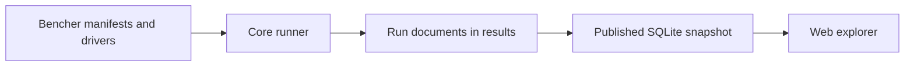

# Engine architecture

A benchmark run resolves a catalog selection, prepares the selected library
drivers and writes their measurements to a document. The catalog supplies the
library-specific API mapping; core supplies selection and execution contracts.

## Repositories and packages

The catalog keeps each adapter beside its source pin for review. Upstream
libraries need no spatial-bench integration. Run records have a separate
review/publication path in the results repository.

Within core, `spatial-bench-core` handles the catalog, execution and result types;
`spatial-bench-cli` exposes these operations. `spatial-bench-dataset` generates
shared inputs. `spatial-bench-measure` provides Criterion measurement for Rust
drivers; `spatial-bench-charting` renders local charts. Generated Rust programs
depend on the measurement crate.

## Cases, selectors and points

A manifest describes a library, its source and drivers, and the workloads those
drivers support. Matrix expansion creates cases with fixed tags. Each case also
has parameter domains/defaults, an adapter and supported runners.

For kdtree, `axis=f64` and `k=1` identify one case; `tree_size` and `query_count`
are runtime parameters. Resolving them produces a point's workload tag map.
Selectors both filter cases and constrain these parameter values. Omitted
parameters contribute their defaults.

Core validates shared tags against its vocabulary. Library options use namespaced
keys such as `kiddo.stem`. It derives `defaults_or_tuned` by comparing case values
with manifest defaults; the declaration of those defaults needs library review.

Repeated measurements can share a tag map. Their run records supply the source
and machine context needed to compare them.

## Driver preparation and execution

The `rust-codegen` adapter generates a program containing the selected compile-time
instantiations, then builds it with Cargo. Runtime sweeps reuse that binary.
The `exec` adapter prepares a C++ executable or Python environment from its build
recipe. Both receive resolved cases through the same harness protocol.

Compile-time axes depend on the library. Kdtree specializes on scalar type;
another driver may also specialize dimensionality or layout. Deterministic code
generation and content-based build directories let repeated selections reuse work.

The run pipeline chooses a shared Rust toolchain for selected Rust drivers,
checks the machine fingerprint and warns about large memory estimates before
measuring. The estimate is a lower bound that excludes index/build overhead.
`conform` uses the same preparation path, then compares the driver's `--list`
output with the declared compile-time registrations.

## Measurement and recorded results

The harness protocol sends one JSON `RunSpec` on stdin with a budget and
resolved cases, including generator path, distribution and seed. Drivers emit
`Point` records as JSON Lines on stdout and diagnostics on stderr. The protocol
version lets a driver reject input it cannot interpret.

Drivers generate inputs and prepare their query state before timing. Rust query
drivers use the measurement crate's Criterion wrapper. Current C++ and Python
adapters use their own sampling loops. Each driver defines the timed API calls
and which allocation and result-processing costs enter the measurement.

A run document combines the driver points with machine, toolchain and subject
provenance. Core `publish` projects a results checkout into SQLite, placing common
tags in columns and extension tags in `point_tags`. The results repository's
publication workflow compresses and distributes that snapshot. The original
run JSON remains the fuller record. See the
[methodology](https://spatial-bench.org/methodology) for estimators and the
[results documentation](https://github.com/spatial-bench/spatial-bench-results/blob/main/CONTRIBUTING.md)
for publication and provenance.

## Contract changes

Shared vocabulary, manifest schema, harness protocol, generator stream and run
schema are distinct interfaces. Adding a value to an existing tag usually needs
vocabulary and driver changes. Changing input/output structure requires updating
the affected readers and deciding how incompatible versions will be rejected.
The [reference](reference.md#source-contracts) points to their definitions.
[Dataset](adding-datasets.md) and [query](adding-query-types.md) guides describe
the cross-repository extension work.
